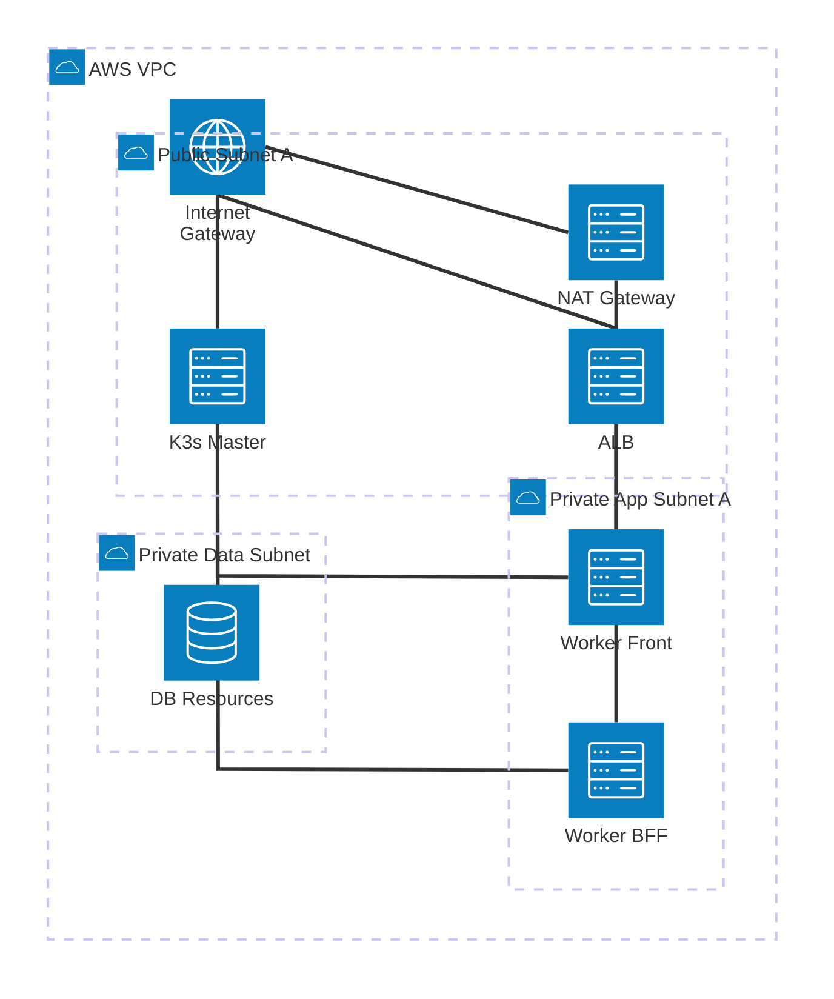

# Proyecto AWS K3S - D-Una

Este proyecto automatiza la creación de un clúster de **K3s** altamente disponible en **AWS** utilizando **Terraform**.

## Estructura del Proyecto

El proyecto está organizado en módulos para una mejor gestión y escalabilidad:

- **`modules/network`**: Configura la VPC, subredes (Públicas, Privadas App, Privadas Datos), Internet Gateway y NAT Gateway.
- **`modules/security`**: Define los Security Groups para el Balanceador de Carga (ALB), los nodos Master y los nodos Worker.
- **`modules/compute`**: Despliega las instancias EC2 para los nodos Master (en subred pública) y Worker (distribuidos entre subred pública y privada), configurando K3s mediante `user_data`.
- **`modules/load_balancer`**: Configura un Application Load Balancer (ALB) para distribuir el tráfico hacia los workers en ambas subredes.

## Características Principales

- **Arquitectura Híbrida**: Nodo Master y el primer Worker en subred pública para facilitar la administración y pruebas iniciales.
- **Seguridad**: Workers adicionales y recursos de datos protegidos en subredes privadas. Acceso controlado mediante Security Groups y NAT Gateway.
- **Escalabilidad**: Definición de entornos (vía `locals` y `terraform.workspace`) para ajustar el tamaño del clúster (dev/prod).
- **Backend Remoto**: Configurado para usar un bucket S3 para el estado de Terraform.

## Requisitos Previos

- [Terraform](https://www.terraform.io/downloads.html) >= 1.5.0
- Configuración de credenciales de AWS (profile `default` por defecto).
- Una llave SSH en AWS llamada `testKey` (configurable en `variables.tf`).

## Despliegue

1. Inicializar Terraform:
   ```bash
   terraform init
   ```

2. Validar la configuración:
   ```bash
   terraform validate
   ```

3. Visualizar el plan de ejecución:
   ```bash
   terraform plan
   ```

4. Aplicar los cambios:
   ```bash
   terraform apply
   ```

## Diagrama de Arquitectura (Subred Privada - 2 Workers)

El siguiente diagrama representa la arquitectura simplificada, donde el **Master** se encuentra en la subred pública para administración, y los **2 Workers (Front y BFF)** se encuentran protegidos en la subred privada de la Zona A:



### Cambios Recientes
- **Reducción a 2 Workers**: Se eliminó un worker para simplificar el clúster.
- **Migración a Red Privada**: Todos los workers ahora residen en la subred privada de la Zona `us-east-1a`.
- **Nombres de Rol**: 
  - `worker-1-front`: Dedicado a tareas de Front-end.
  - `worker-2-bff`: Dedicado a tareas de Backend-for-Frontend.
- **Acceso**: El balanceador (ALB) sigue distribuyendo el tráfico a ambos workers desde la red pública.

## Despliegue Actualizado
1. **Inicializar**: `terraform init`
2. **Validación**: `terraform validate` (Configuración de 2 workers privados validada exitosamente).
3. **Planificar**: `terraform plan`
4. **Aplicar**: `terraform apply`