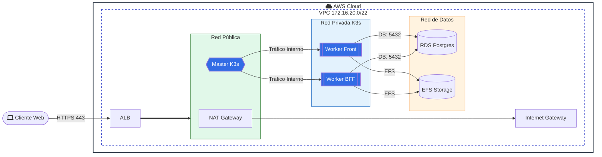

# Diagrama de Arquitectura AWS (Proyecto D-Una)

Este documento resume la arquitectura objetivo y su estado de implementacion en Terraform.

## 1) Arquitectura actual
 - Pública: NAT Gateway y Master
- Privada: App/K3s (2 workers: Front y BFF)
- Privada: Data/DB (RDS y EFS)
 

## 2) Estado actual implementado en Terraform

- Implementado: VPC, subredes públicas/app/data, IGW, NAT, SGs, 1 master K3s, 2 workers K3s, ALB HTTP, RDS, EFS.
- Seguridad: Solo los workers acceden a RDS/EFS. NAT restringe salida a internet.
- Pendiente: listener HTTPS con ACM y Route 53 (depende de variables de DNS).

Este diagrama representa la arquitectura real y simplificada de alta disponibilidad en AWS para una aplicación web orquestada con K3s.

**Notas:**
- El clúster se ha optimizado a 2 workers (Front y BFF) en subred privada.
- La capa de persistencia (RDS/EFS) está protegida y solo accesible desde los workers.
- El master está en subred pública solo para administración.
- Red Pública (Verde): Aloja los NAT Gateways. Es la única con salida directa a Internet. El tráfico del balanceador (ALB) pasa por aquí para llegar a la aplicación.

- Red Privada K3s (Azul): Donde vive la lógica. Contiene los Masters (cerebro del cluster) y Workers (donde corre tu App). Están aislados de Internet.
