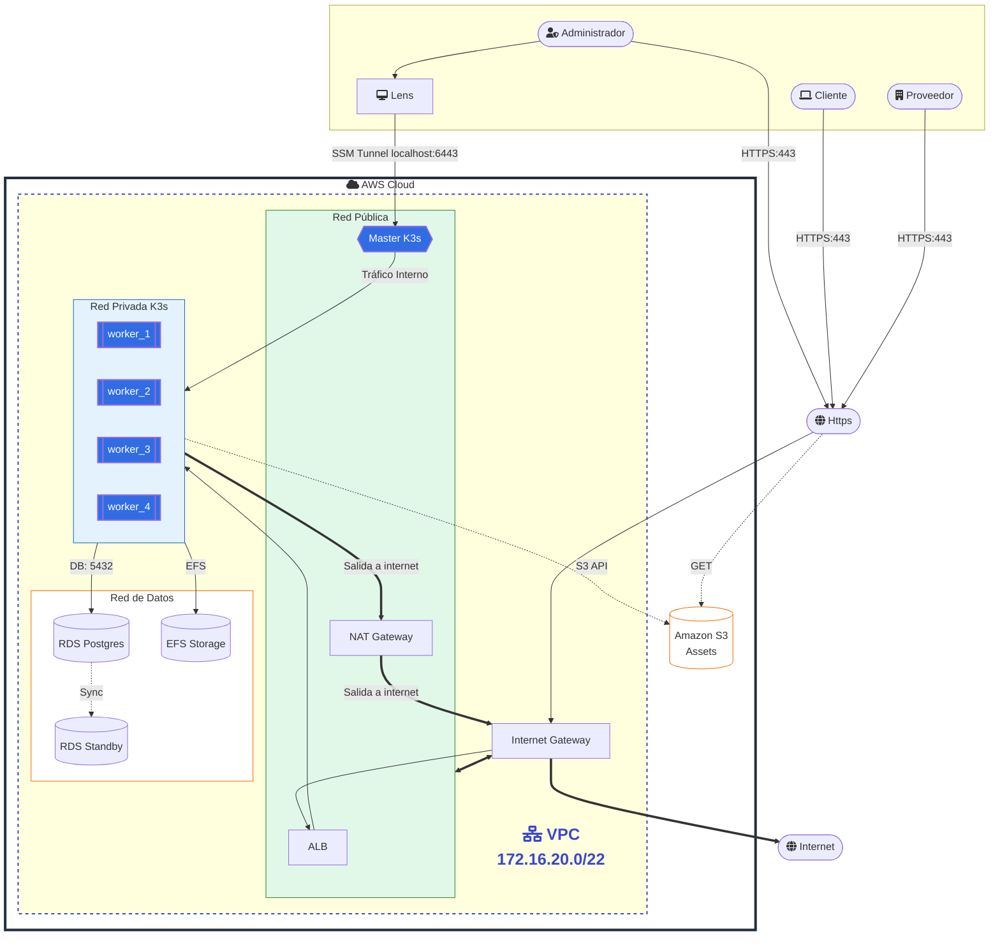

# 🏗️ Especificación de Infraestructura — Plataforma Duna

Este documento detalla la arquitectura de infraestructura, los recursos de nube y los pipelines de CI/CD para la plataforma Duna, basándose en el enfoque **IaC (Infrastructure as Code)**.

### Descripcion de la infraestructura
La infraestructura propone una arquitectura de alta disponibilidad (Multi-AZ) para una aplicacion en AWS. El trafico ingresa por HTTPS y sigue la ruta WAF -> ALB. Dentro de la VPC `172.16.20.0/22`, la red se segmenta en tres capas: publica (egreso por NAT), privada K3s (nodos master/worker) y privada de datos (RDS). Esta separacion mejora seguridad, control de trafico y resiliencia ante fallas de una zona de disponibilidad.

## 1. Estado actual (implementado)

La infraestructura desplegada hoy en AWS con Terraform incluye:
- VPC `172.16.20.0/22`.
- Subred pública (Master, NAT, ALB).
- Subred privada App/K3s (4 workers: worker_1, worker_2, worker_3, worker_4).
- Subred privada Data/DB (RDS y EFS).
- Internet Gateway y NAT Gateway.
- Security Groups para ALB, master y workers.
- 1 nodo master K3s en subred pública (admin).
- 4 nodos worker K3s en subred privada (worker_1, worker_2, worker_3, worker_4).
- ALB (HTTP:80) con target group a workers.
- RDS PostgreSQL Multi-AZ en subredes de datos.
---

## 2. Topología de Red (AWS VPC)

| Recurso | Configuración | Propósito |
| :--- | :--- | :--- |
| **VPC** | `172.16.20.0/22` | Red aislada para todo el ecosistema. |
| **VPC Name (tag)** | `VPC-Duna` (cuando `env = dev`, en otros entornos `VPC-<env>`) | Etiqueta `Name` aplicada a la VPC para facilitar identificación en la consola |
| **Subnets Públicas** | 2 AZs (Multi-AZ) | Hosting de ALB (Application Load Balancer), NAT Gateways y 1 K3s/EKS Master. |
| **Subnets Privadas (App)** | 2 AZs | Nodos de K3s/EKS para BFFs, Monolito y Workers. |
| **Subnets Privadas (Data)** | 2 AZs | PostgreSQL (RDS) y Redis (ElastiCache). |

---

## 3. Recursos IaC (Terraform - `marketplace-infrastructure`)

La infraestructura se gestiona mediante módulos de Terraform en el repositorio central:

### 3.1 `modules/network`
- VPC, subredes publicas/app/data.
- Internet Gateway.
- NAT Gateway por AZ.
- Route tables y asociaciones.

### 3.2 `modules/security` (Topología Zero-Trust)
- **Security Group ALB:** Expuesto a Internet (0.0.0.0/0) en puertos 80/443.
- **Security Group Worker K3s (BFFs):** Acepta tráfico entrante **únicamente** desde el Security Group del ALB. Aquí corren los Pods reactivos Gateway.
- **Security Group Worker K3s (Core Backend):** Acepta tráfico entrante **únicamente** desde el Security Group de los BFFs. Aislado de forma estricta. Es virtualmente imposible rutear o golpear a sus IPs locales desde el ALB o Internet.
- **Security Group RDS/Data:** Acepta tráfico port 5432 **únicamente** del Security Group del Core Backend.

### 3.3 `modules/compute`
- 1 master K3s (público).
- 4 workers K3s (privados).

Se utiliza un clúster ligero para optimizar costos mientras se mantiene la compatibilidad con K8s:
- **Ingress Controller:** NGINX Ingress o Traefik. Las rutas públicas en el Ingress (`/api/v1/client/**`, `/api/v1/provider/**`) **siempre actúan como proxy-pass hacia los Services internos de los BFFs**. Jamás existe un Ingress Target directo hacia el Tomcat del Core Backend.
- **Certificados:** Cert-Manager con Let's Encrypt (HTTPS).
- **HPA (Horizontal Pod Autoscaler):** Configurado para escalar dinámicamente los contenedores reactivos BFFs basado en uso de CPU (>70%), protegiendo de saturación transaccional al Core.

### 3.4 `modules/load_balancer`
- ALB.
- Target Group.
- Listener HTTP (80).
- Attachments de workers al target group.

### 3.5 Base de Datos (RDS PostgreSQL)
- **Instancia:** `db.t3.medium` (MVP).
- **Configuración:** Multi-AZ activado, Cifrado con AWS KMS.
- **Acceso:** Solo permitido desde el Security Group del clúster de aplicaciones.

### 3.6 Broker de Eventos (Kafka/MSK)
- **Opción MVP:** Cluster de Kafka gestionado (Amazon MSK) o Bitnami Kafka sobre Kubernetes.
- **Tópico Principal:** `duna.orders.events` (Particiones: 3, Replicación: 2).

### 3.7 Secretos y Configuración
- **AWS Secrets Manager:** Almacena:
    - `DB_PASSWORD`
    - `KAFKA_SASL_PASSWORD`
    - `JWT_PRIVATE_KEY`
    - `SENDGRID_API_KEY`
    - `AES_ENCRYPTION_KEY` (Para PII Ley 1581).

### 3.8 `modules/storage`
- Bucket de Amazon S3 (`var.env-assets-...`).
- Políticas de acceso (`aws_s3_bucket_policy`).
- Configuración CORS (`aws_s3_bucket_cors_configuration`).
---

## 4. Pipelines CI/CD (Azure DevOps)

---

## 5. ❗ Gaps de Infraestructura Identificados
MIOS
| ID | GAP | Descripción / Riesgo |
| :--- | :--- | :--- |
| **GAP-INF-01** | **DNS/TLS** | Route53 y HTTPS dependen de definir `route53_zone_id` y `route53_record_name`. |
| **GAP-INF-02** | **Capa de Datos** | RDS esta implementado; falta definir estrategia operativa (credenciales, rotacion y backups gestionados). |
| **GAP-INF-03** | **Acceso administrativo** | No hay bastion/SSM formal para operar nodos en subred privada. |
| **GAP-INF-04** | **Observabilidad/Backups** | Falta definir monitoreo y politicas de respaldo para capa de datos. |
                                                                                                               
CARLOS
| ID | GAP | Descripción / Riesgo |
| :--- | :--- | :--- |
| **GAP-INF-01** | **Monitoreo/Logging** | No se ha definido el stack de observabilidad (CloudWatch vs ELK). |
| **GAP-INF-02** | **CDN para Assets** | Falta configuración de CloudFront para optimizar la carga de las 3 SPAs. |
| **GAP-INF-03** | **Backup Strategy** | No hay política formal de retención de backups para RDS (Retención de 7 días sugerida). |
| **GAP-INF-04** | **VPN/Bastion** | No se define cómo accederán los devs a la DB en subnets privadas para debugging. |
| **GAP-INF-05** | **Acceso administrativo** | No hay bastion/SSM formal para operar nodos en subred privada. |

---

## 6. Recomendaciones de Escalabilidad
- Transicionar de K3s a **Amazon EKS** cuando el tráfico supere los 10k usuarios concurrentes.
- Implementar **Redis ElastiCache** para el caché de búsqueda (Wilson Score) y sesiones de BFF.

---
## 7. Diagrama (objetivo)
Relaciono un diagrama en mermaid sin multi-AZ; la idea es que se vea claro y entendible, sin sobrecargarlo con detalles de alta disponibilidad. El diagrama refleja la arquitectura general, con VPC, subredes, ALB, RDS y el cluster K3s con sus nodos master/worker. Se destacan las conexiones principales y los flujos de tráfico entre componentes.

---            

