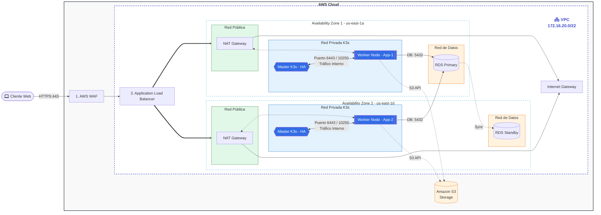

# Diagrama de Arquitectura AWS (Proyecto D-Una)

Este documento resume la arquitectura objetivo y su estado de implementacion en Terraform.

## 1) Arquitectura objetivo

 - Publica: NAT Gateway (2 subredes)
 - Privada: App/K3s (2 subredes)
 - Privada: Data/DB (2 subredes)

## 2) Estado actual implementado en Terraform

- Implementado: VPC, subredes públicas/app/data, IGW, NAT por AZ, SGs, 2 masters K3s, 2 workers K3s, ALB HTTP.
- Configurado: Módulo AWS WAF regional y de Base de datos (RDS PostgreSQL Multi-AZ).
- Almacenamiento: Amazon S3 (Assets) provisioning con políticas y CORS.
- Pendiente: listener HTTPS con ACM y Route 53 (depende de variables de DNS).

Este diagrama representa la arquitectura objetivo de alta disponibilidad (Multi-AZ) en AWS para una aplicacion web orquestada con K3s.

**1. Flujo de Entrada y Seguridad (Capas 1, 2 y 3)**

- Punto de Inicio: El cliente accede vía HTTPS (puerto 443).

- WAF (Web Application Firewall): Filtra ataques (como inyecciones SQL o ataques de bots) antes de que lleguen a la aplicación.
- ALB (Load Balancer): Distribuye el tráfico entrante de manera equitativa entre las dos Zonas de Disponibilidad (us-east-1a y us-east-1d).

**2. Estructura de Red (VPC)**

La red está segmentada en 3 capas de subredes para maximizar la seguridad:

- Red Pública (Verde): Aloja los NAT Gateways. Es la única con salida directa a Internet. El tráfico del balanceador (ALB) pasa por aquí para llegar a la aplicación.
- Red Privada K3s (Azul): Donde vive la lógica. Contiene los Masters (cerebro del cluster) y Workers (donde corre tu App). Están aislados de Internet.
- Red de Datos (Naranja): La capa más profunda y protegida, exclusiva para la base de datos RDS.

**3. Alta Disponibilidad y Resiliencia**

- Multi-AZ: Si una zona de AWS (como la 1a) falla, la 1d sigue operando sin interrupción.
- K3s HA Sync: Los nodos Master están sincronizados para que el orquestador nunca caiga.
- RDS Primary/Standby: La base de datos principal (RDS_P) replica los datos en tiempo real a una de respaldo (RDS_S). Si la principal falla, la de respaldo toma el control automáticamente.

**4. Flujo de Salida (Mantenimiento)**

Como los nodos de K3s están en una red privada, no pueden "ver" Internet directamente. Cuando necesitan descargar una actualización o una imagen de contenedor, envían el tráfico a través del NAT Gateway en la red pública, que sale por el Internet Gateway (IGW).

