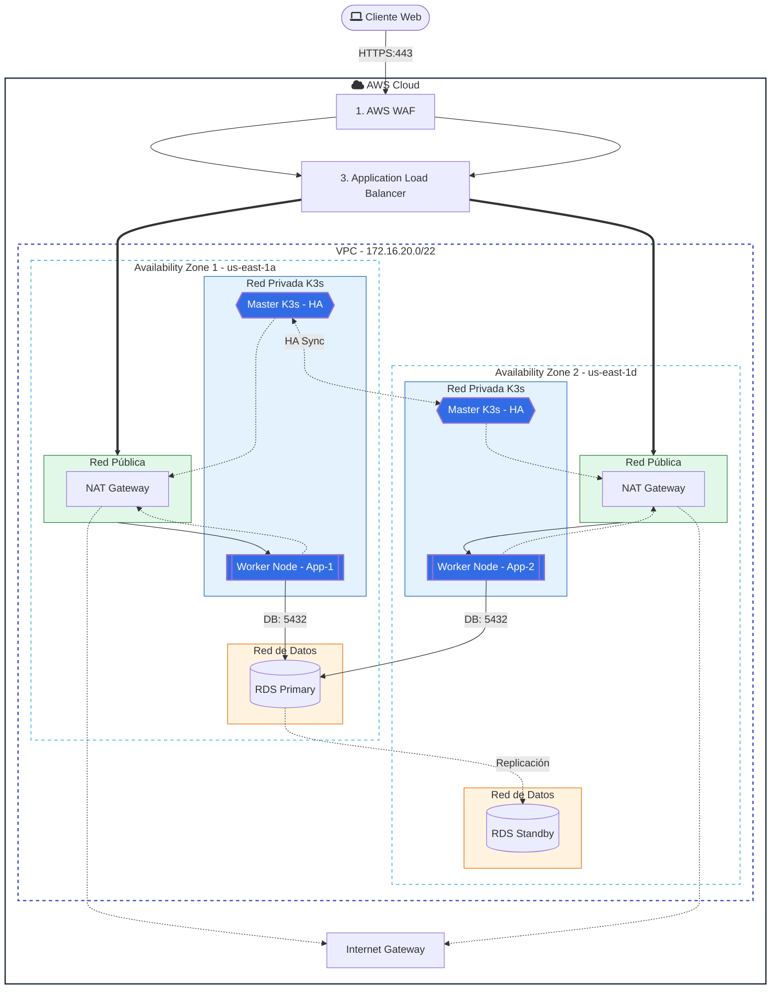

# Especificacion de Infraestructura - Proyecto D-Una

Este documento detalla la arquitectura de infraestructura, los recursos de nube y los pipelines de CI/CD para la plataforma Duna, basándose en el enfoque **IaC (Infrastructure as Code)**.

## 1. Estado actual (implementado)

La infraestructura desplegada hoy en AWS con Terraform incluye:
- VPC `172.16.20.0/22`.
- 2 subredes publicas (Multi-AZ).
- 2 subredes privadas App/K3s (Multi-AZ).
- 2 subredes privadas Data/DB reservadas (Multi-AZ).
- Internet Gateway y 2 NAT Gateway (uno por AZ).
- Security Groups para ALB, masters y workers.
- 2 nodos master K3s en subred privada App (HA).
- 2 nodos worker K3s en subred privada App.
- ALB (HTTP:80) con target group a workers.
- WAF regional asociado al ALB.
- RDS PostgreSQL Multi-AZ en subredes de datos.
- Bucket S3 para alojamiento y persistencia de activos estáticos (CORS habilitado).

---

## 2. Topologia de Red (AWS VPC)

| Recurso | Configuración | Propósito |
| :--- | :--- | :--- |
| **VPC** | `172.16.20.0/22` | Red aislada para todo el ecosistema. |
| **VPC Name (tag)** | `VPC-Duna` (cuando `env = dev`, en otros entornos `VPC-<env>`) | Etiqueta `Name` aplicada a la VPC para facilitar identificación en la consola |
| **Subnets Publicas** | 2 AZs (Multi-AZ) | Hosting de ALB y NAT Gateways. |
| **Subnets Privadas (App)** | 2 AZs | Nodos de K3s/EKS para BFFs, Monolito y Workers. |
| **Subnets Privadas (Data)** | 2 AZs | PostgreSQL (RDS) y Redis (ElastiCache). |

---

## 3. Recursos IaC por modulo Terraform

### 3.1 `modules/network`
- VPC, subredes publicas/app/data.
- Internet Gateway.
- NAT Gateway por AZ.
- Route tables y asociaciones.

### 3.2 `modules/security`
- Security Group ALB.
- Security Group Master K3s.
- Security Group Worker K3s.

### 3.3 `modules/compute`
- 2 masters K3s (privados).
- 2 workers K3s (privados).

Se utiliza un clúster ligero para optimizar costos mientras se mantiene la compatibilidad con K8s:
- **Ingress Controller:** NGINX Ingress para ruteo basado en host (`cliente.duna.com`, `api.duna.com`).
- **Certificados:** Cert-Manager con Let's Encrypt (HTTPS).
- **HPA (Horizontal Pod Autoscaler):** Configurado para los BFFs basado en uso de CPU (>70%).

### 3.4 `modules/load_balancer`
- ALB.
- Target Group.
- Listener HTTP (80).
- Attachments de workers al target group.

### 3.5 Base de Datos (RDS PostgreSQL)
- **Instancia:** `db.t3.medium` (MVP).
- **Configuración:** Multi-AZ activado, Cifrado con AWS KMS.
- **Acceso:** Solo permitido desde el Security Group del clúster de aplicaciones.

### 3.6 Broker de Eventos (Kafka/MSK)
- **Opción MVP:** Cluster de Kafka gestionado (Amazon MSK) o Bitnami Kafka sobre Kubernetes.
- **Tópico Principal:** `duna.orders.events` (Particiones: 3, Replicación: 2).

### 3.7 Secretos y Configuración
- **AWS Secrets Manager:** Almacena:
    - `DB_PASSWORD`
    - `KAFKA_SASL_PASSWORD`
    - `JWT_PRIVATE_KEY`
    - `SENDGRID_API_KEY`
    - `AES_ENCRYPTION_KEY` (Para PII Ley 1581).

### 3.8 `modules/storage`
- Bucket de Amazon S3 (`var.env-assets-...`).
- Políticas de acceso (`aws_s3_bucket_policy`).
- Configuración CORS (`aws_s3_bucket_cors_configuration`).
---

## 4. Arquitectura objetivo (condicional)

Recursos que se implementan cuando se suministra configuracion DNS/certificado:

- ACM + listener HTTPS (443).

Mejoras recomendadas adicionales:
- Endurecimiento de acceso administrativo (Bastion o SSM Session Manager).


---

## 5. Validacion de Terraform

Comando ejecutado en este repositorio:
- `terraform init -backend=false`
- `terraform validate`

Resultado: configuracion valida.

### Activacion fase 2 (opcional por componente)

- Estado por defecto:
    - `create_waf = true`
    - `create_rds = true`
    - `enable_https = true`
    - `create_acm_certificate = true`
    - `create_route53_record = true`
- Comportamiento seguro:
    - Si `route53_zone_id` y `route53_record_name` estan vacios, HTTPS/Route53 se omiten automaticamente.
    - Si `db_password` esta vacio, Terraform genera password aleatoria para RDS.
- Ejecucion recomendada:
    - `terraform plan -var-file=terraform.tfvars`
    - `terraform apply -var-file=terraform.tfvars`
- WAF:
    - Ya activo por defecto.
- RDS Multi-AZ:
    - Ya activo por defecto.
    - `db_password` es opcional.

---

## 6. Gaps de Infraestructura Identificados

| ID | GAP | Descripción / Riesgo |
| :--- | :--- | :--- |
| **GAP-INF-01** | **DNS/TLS** | Route53 y HTTPS dependen de definir `route53_zone_id` y `route53_record_name`. |
| **GAP-INF-02** | **Capa de Datos** | RDS esta implementado; falta definir estrategia operativa (credenciales, rotacion y backups gestionados). |
| **GAP-INF-03** | **Acceso administrativo** | No hay bastion/SSM formal para operar nodos en subred privada. |
| **GAP-INF-04** | **Observabilidad/Backups** | Falta definir monitoreo y politicas de respaldo para capa de datos. |

---

## 7. Recomendaciones de Escalabilidad
- Transicionar de K3s a **Amazon EKS** cuando el tráfico supere los 10k usuarios concurrentes.
- Implementar **Redis ElastiCache** para el caché de búsqueda (Wilson Score) y sesiones de BFF.

---
## 8. Mapeo de roles y verificación rápida

En este repositorio se ha definido un mapeo fijo de roles para los workers del clúster K3s. El despliegue actual esperado es **6 workers** repartidos en 2 AZs (3 por AZ) con las siguientes etiquetas lógicas:

- **AZ1 (us-east-1a)**
    - Worker 1 — Client-BFF
    - Worker 2 — Provider-BFF
    - Worker 3 — Admin-BFF

- **AZ2 (us-east-1d)**
    - Worker 4 — Client-BFF
    - Worker 5 — Provider-BFF
    - Worker 6 — Admin-BFF

Los nombres visibles en la consola EC2 (`tag:Name`) se generan desde `modules/compute` y contienen el patrón `worker-<env>-<n>-<role>` (por ejemplo `worker-dev-1-Client-BFF`).

Comandos útiles para verificar desde tu máquina local (AWS CLI):

- Listar instancias por tag `Name` (ejemplo):

```bash
aws ec2 describe-instances --region us-east-1 --filters \
    "Name=tag:Name,Values=Master-dev-*,worker-dev-*" \
    --query "Reservations[].Instances[].{Name:Tags[?Key=='Name']|[0].Value,State:State.Name,PrivateIP:PrivateIpAddress,InstanceId:InstanceId}" \
    --output table
```

- Buscar por prefijo `worker-dev` usando `jq` (más flexible cuando hay muchos tags o variaciones):

```bash
aws ec2 describe-instances --region us-east-1 --output json \
    | jq -r '.Reservations[].Instances[] | select(.Tags[]?.Value | test("worker-dev"; "i")) | [.InstanceId, (.Tags[]? | select(.Key=="Name") | .Value), .State.Name, .PrivateIpAddress] | @tsv'
```

### ¿Qué es `jq` y por qué usarlo?

`jq` es una pequeña utilidad de línea de comandos para procesar y filtrar JSON. AWS CLI devuelve JSON por defecto; `jq` te permite extraer campos concretos, filtrar por patrones y formatear la salida para lectura humana o para scripts.

Ventajas de usar `jq` con AWS CLI:
- Filtrado preciso: extraes solo los campos que necesitas (Name, State, IP, InstanceId).
- Flexibilidad: puedes usar expresiones regulares y condicionales para encontrar instancias por patrón de tag.
- Integración en scripts: la salida puede transformarse fácilmente a TSV/CSV para análisis o alertas.

Ejemplo rápido:
```bash
# Mostrar InstanceId y Name de todas las instancias que tienen tag con "worker-dev"
aws ec2 describe-instances --output json | jq -r '.Reservations[].Instances[] | select(.Tags[]?.Value | test("worker-dev";"i")) | [.InstanceId, (.Tags[]? | select(.Key=="Name") | .Value)] | @tsv'
```

Instalación mínima (Linux/WSL): `sudo apt-get install jq` o en macOS: `brew install jq`.

---

## 9. Diagrama (objetivo)

### 9.1 Comprobar tags y atributos desde Terraform

Además de usar AWS CLI y `jq`, puedes inspeccionar recursos y exponer valores directamente desde Terraform:

- Inspeccionar un recurso en el state:

```bash
# Muestra los atributos del primer worker (incluye tags)
terraform state show module.compute.aws_instance.worker[0]
```

- Exponer valores como outputs del módulo `compute` (ya añadidos en `modules/compute/outputs.tf`):

```hcl
output "worker_names" {
    value = [for w in aws_instance.worker : w.tags["Name"]]
}

output "worker_private_ips" {
    value = aws_instance.worker[*].private_ip
}
```

- Después de `terraform apply`, desde el root puedes mostrar los outputs del módulo (si los exportas en el root) con:

```bash
terraform output compute_worker_names
terraform output compute_worker_private_ips
```

Si no quieres exportar outputs en el root, usa `terraform state show` para leer atributos individuales.




