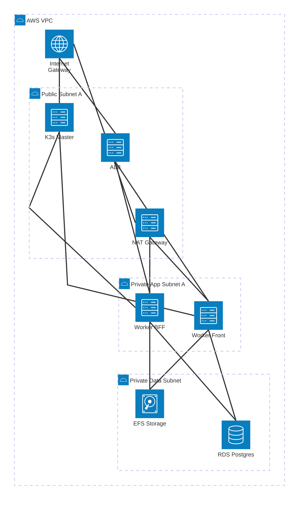

# Proyecto AWS K3S - D-Una

Este proyecto automatiza la creación de un clúster de **K3s** altamente disponible en **AWS** utilizando **Terraform**.

## Estructura del Proyecto

El proyecto está organizado en módulos para una mejor gestión y escalabilidad:

- **`01-K3S/`**: Infraestructura base distribuida en módulos:
    - **`network`**: Configura la VPC, subredes (Públicas, Privadas App, Privadas Datos), Internet Gateway y NAT Gateway.
    - **`security`**: Define los Security Groups para el Balanceador de Carga (ALB), los nodos Master y los nodos Worker.
    - **`compute`**: Despliega las instancias EC2 para los nodos Master (en subred pública) y Worker (en subred privada), configurando K3s mediante `user_data`.
    - **`load_balancer`**: Configura un Application Load Balancer (ALB) para distribuir el tráfico hacia los workers.
- **`02-PERSISTENCE/`**: Servicios de persistencia de datos:
    - **`db`**: Instancia de Amazon RDS (PostgreSQL) para n8n, protegida en subredes de datos.
    - **`storage`**: Amazon EFS (Elastic File System) para almacenamiento compartido/persistente del clúster K3s.

## Características Principales

- **Arquitectura Híbrida**: Nodo Master en subred pública para administración y Workers protegidos en subred privada.
- **Persistencia Robusta**: Base de datos gestionada (RDS) y almacenamiento compartido (EFS) con acceso restringido solo a los Workers.
- **Seguridad**: Uso de subredes privadas, NAT Gateway para salida a internet y Security Groups específicos por rol.
- **Infraestructura como Código (IaC)**: Organizado en capas (K3S y Persistence) para modularizar el despliegue.

## Requisitos Previos

- [Terraform](https://www.terraform.io/downloads.html) >= 1.5.0
- Configuración de credenciales de AWS (profile `default` por defecto).
- Una llave SSH en AWS llamada `testKey` (configurable en `variables.tf`).

## Despliegue

1. Inicializar Terraform:
   ```bash
   terraform init
   ```

2. Validar la configuración:
   ```bash
   terraform validate
   ```

3. Visualizar el plan de ejecución:
   ```bash
   terraform plan
   ```

4. Aplicar los cambios:
   ```bash
   terraform apply
   ```

## Diagrama de Arquitectura (Subred Privada - 2 Workers)

El siguiente diagrama representa la arquitectura simplificada, donde el **Master** se encuentra en la subred pública para administración, y los **2 Workers (Front y BFF)** se encuentran protegidos en la subred privada de la Zona A:



### Cambios Recientes (Actualizado)
- **Capa de Persistencia**: Se implementó el módulo `02-PERSISTENCE` con RDS (Postgres 17.6) y EFS.
- **Reducción a 2 Workers**: Se optimizó el clúster a 2 nodos workers en subred privada.
- **Seguridad de Datos**: Los servicios de persistencia (RDS/EFS) solo permiten tráfico desde el Security Group de los Workers.
- **Nombres de Rol**: 
  - `worker-1-front`: Dedicado a tareas de Front-end.
  - `worker-2-bff`: Dedicado a tareas de Backend-for-Frontend.

## Despliegue Actualizado
1. **Inicializar**: `terraform init`
2. **Validación**: `terraform validate` (Configuración de 2 workers privados validada exitosamente).
3. **Planificar**: `terraform plan`
4. **Aplicar**: `terraform apply`