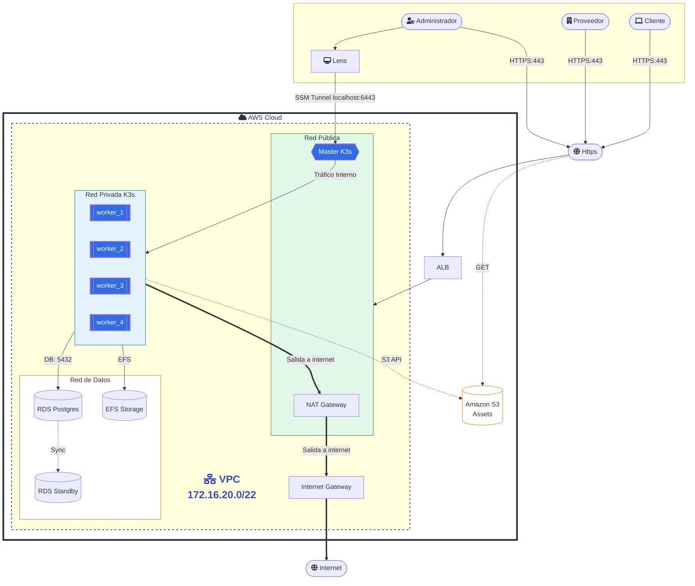

# Proyecto AWS K3S - D-Una

Este proyecto automatiza la creación de un clúster de **K3s** altamente disponible en **AWS** utilizando **Terraform**.

## Estructura del Proyecto

El proyecto está organizado en módulos para una mejor gestión y escalabilidad. Esta es la parte más útil para entender qué ya existe hoy:

- **`01-K3S/`**: Infraestructura base distribuida en módulos:
    - **`network`**: Configura la VPC, subredes (Públicas, Privadas App, Privadas Datos), Internet Gateway y NAT Gateway.
    - **`security`**: Define los Security Groups para el Balanceador de Carga (ALB), los nodos Master y los nodos Worker.
    - **`compute`**: Despliega las instancias EC2 para los nodos Master (en subred pública) y Worker (en subred privada), configurando K3s mediante `user_data`.
    - **`load_balancer`**: Configura un Application Load Balancer (ALB) para distribuir el tráfico hacia los workers.
- **`02-PERSISTENCE/`**: Servicios de persistencia de datos usados por el laboratorio:
    - **`db`**: Instancia de Amazon RDS (PostgreSQL) para n8n, protegida en subredes de datos.
    - **`storage`**: Amazon EFS (Elastic File System) para almacenamiento compartido/persistente del clúster K3s.
- **`03-K3S-Storage/`**: Manifiestos para persistencia de K3s con `pv` y `pvc`, útiles para pruebas de almacenamiento.
- **`04-N8N/`**: Despliegue de n8n con `Deployment`, `Service`, `Secret`, `ConfigMap` y PVC.
- **`05-OLLAMA/`**: Manifiestos e instrucciones para desplegar Ollama en K3s o de forma manual.
- **`06-KAFKA/`**: Instrucciones y valores de ejemplo para Kafka con Bitnami o Strimzi.
- **`Docs/`**: Diagramas, imágenes y documentación complementaria del proyecto.
- **`Locals/setup/`**: Scripts locales de apoyo para desarrollo y acceso.

## Características Principales

- **Arquitectura Híbrida**: Nodo Master en subred pública para administración y Workers protegidos en subred privada.
- **Persistencia Robusta**: Base de datos gestionada (RDS) y almacenamiento compartido (EFS) con acceso restringido solo a los Workers.
- **Seguridad**: Uso de subredes privadas, NAT Gateway para salida a internet y Security Groups específicos por rol.
- **Infraestructura como Código (IaC)**: Organizado en capas (K3S y Persistence) para modularizar el despliegue.

## Requisitos Previos

- [Terraform](https://www.terraform.io/downloads.html) >= 1.5.0
- Configuración de credenciales de AWS (profile `default` por defecto).
- Una llave SSH en AWS llamada `testKey` (configurable en `variables.tf`).

## Seguridad Básica

Este proyecto está pensado como laboratorio, pero si lo vas a seguir usando conviene reducir exposición:

1. Restringe el acceso SSH del master a una IP concreta o a una VPN.
2. Revisa los Security Groups para cerrar puertos que no uses.
3. Sustituye valores sensibles hardcodeados por `Secret`, `ConfigMap` o variables de entorno.
4. No dejes recursos públicos abiertos si ya no los necesitas.

## Despliegue

Los comandos de despliegue y el orden completo de ejecución están documentados en [Implementacion.md](c:/ITM/AWS%20Proyecto%20D-Una/Implementacion.md). Usa ese archivo como guía operativa paso a paso.

## Kafka: dos rutas posibles

Si vas a seguir este proyecto como ejemplo, Kafka puede instalarse de dos formas. Para alguien que empieza, la idea más simple es probar una sola ruta primero y no mezclar ambas al mismo tiempo.

### Ruta A: Kafka con Bitnami y Helm

Esta ruta es la más directa para un laboratorio.

1. Verifica que `kubectl` ya apunte al clúster K3s.
2. Agrega el repositorio de Bitnami:
    ```bash
    helm repo add bitnami https://charts.bitnami.com/bitnami
    helm repo update
    ```
3. Instala Kafka:
    ```bash
    helm install kafka bitnami/kafka
    ```
4. Revisa los pods:
    ```bash
    kubectl get pods -l app.kubernetes.io/name=kafka
    ```
5. Si quieres ajustar recursos o comportamiento, revisa el archivo `06-KAFKA/Kafka_values.yaml`.

### Ruta B: Kafka con Strimzi

Esta ruta es más ordenada si quieres manejar Kafka como recurso nativo de Kubernetes.

1. Instala el Cluster Operator de Strimzi.
2. Aplica el recurso `Kafka` que define el clúster.
3. Espera a que los pods del operador y de Kafka queden en `Running`.
4. Crea topics y usuarios si los necesitas.
5. Conecta n8n o cualquier otra aplicación al bootstrap service que genere Strimzi.

Documentación oficial de Strimzi:

- Guía principal: https://strimzi.io/docs/operators/latest/full/deploying.html
- Quick starts: https://strimzi.io/quickstarts/

### Recomendación para principiantes

Si todavía no conoces Kafka, empieza por la Ruta A. Si luego quieres una instalación más formal y controlada, pasa a la Ruta B.

## Cómo Acceder

### n8n

n8n está expuesto como `NodePort` en el puerto `30567` y su servicio interno escucha en `5678`.

1. Verifica el servicio:
    ```bash
    kubectl get svc n8n-service
    ```
2. Abre en el navegador la IP pública del nodo que estés usando con el puerto `30567`:
    ```text
    http://<IP-PUBLICA-DEL-NODO>:30567
    ```
3. Si necesitas probarlo desde tu máquina sin abrir más puertos, también puedes usar un túnel o `port-forward`.

### Ollama

Ollama corre con servicio `ClusterIP`, así que por defecto solo se puede usar dentro del clúster.

1. Comprueba que el servicio exista:
    ```bash
    kubectl get svc ollama
    ```
2. Desde otro pod dentro de K3s, usa el nombre del servicio:
    ```text
    http://ollama:11434
    ```
3. Si quieres probarlo desde tu equipo local, usa un reenvío de puerto:
    ```bash
    kubectl port-forward svc/ollama 11434:11434
    ```
4. Luego abre:
    ```text
    http://localhost:11434
    ```

### Kafka

Kafka se puede acceder de forma diferente según la ruta que elijas.

#### Ruta A: Bitnami con Helm

- Por defecto, Kafka queda como servicio interno.
- Para usarlo desde fuera del clúster, cambia el servicio a `NodePort` o `LoadBalancer` en `06-KAFKA/Kafka_values.yaml`.
- Para verificar el estado, usa:
  ```bash
  kubectl get pods -l app.kubernetes.io/name=kafka
  ```

#### Ruta B: Strimzi

- Accede al bootstrap service que crea Strimzi dentro del clúster.
- Si más adelante quieres acceso externo, define un listener expuesto en el manifiesto de Kafka.
- Para revisar los recursos, usa:
  ```bash
  kubectl get kafka
  kubectl get pods
  ```

Si estás empezando, la regla simple es esta: n8n se abre por `30567`, Ollama se usa por `11434`, y Kafka normalmente empieza interno hasta que realmente necesites exponerlo.

## Diagrama de Arquitectura (Subred Privada - 4 Workers)

El siguiente diagrama representa la arquitectura simplificada, donde el **Master** se encuentra en la subred pública para administración, y los **4 Workers** (`worker_1`, `worker_2`, `worker_3`, `worker_4`) se encuentran protegidos en la subred privada:



